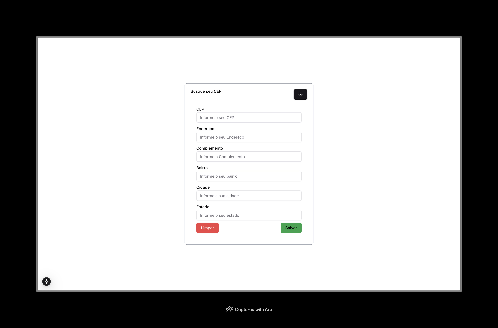

[](https://github.com/victorserpa/buscaCEP/actions/workflows/cy.yml)

# BuscaCEP



> Informe seu CEP e obtenha automaticamente seu endereço. Se o CEP for inválido, mostramos um erro. Caso seja válido, os dados são salvos em um arquivo JSON.

## 💻 Pré-requisitos

Antes de começar, certifique-se de que você tem:

- ✅ **Node.js 20+** instalado.
- ✅ **pnpm** como gerenciador de pacotes (`npm install -g pnpm` caso não tenha).
- ✅ **Next.js 15** e suas dependências instaladas (automaticamente resolvido com `pnpm install`).

## 🚀 Instalando BuscaCEP

Para instalar o **BuscaCEP**, siga estas etapas:

### 🔹 Linux e macOS:

```sh
git clone https://github.com/victorserpa/buscaCEP.git
cd buscacep
pnpm install
pnpm dev

```

### 🪟 Windows

```sh
git clone https://github.com/victorserpa/buscaCEP.git
cd buscacep
pnpm install
pnpm dev

```

## ☕ Usando <BuscaCEP>

Para usar <BuscaCEP>, siga estas etapas:

```sh
pnpm dev       # Inicia o ambiente de desenvolvimento
pnpm build     # Compila o projeto para produção
pnpm start     # Inicia o servidor em modo de produção
```

Para rodar os testes 

```sh
pnpm build     # Certifique-se de que o projeto está compilado
pnpm start     # Inicie o servidor antes dos testes

pnpm run cypress:open  # Abre a interface do Cypress para rodar os testes
```

## 📝 Licença

Esse projeto está sob licença. Veja o arquivo [LICENÇA](LICENSE.md) para mais detalhes.
```
